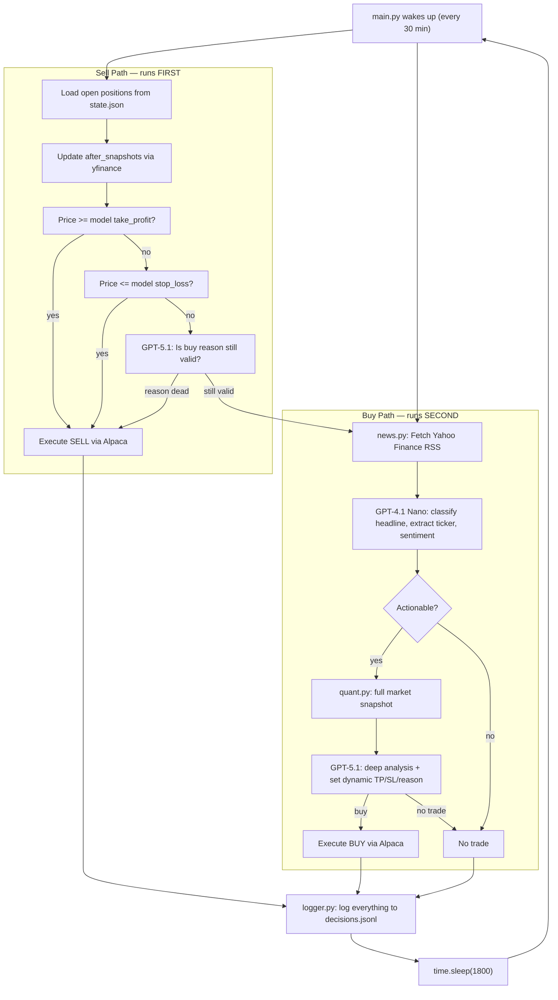

# Cursor-Based Agentic Quant Loop (v2)

## Architecture



## File Structure

```
quant-agent/
├── main.py             # while True loop, sell-first then buy
├── news.py             # RSS fetch + parse headlines
├── llm.py              # Two-model: GPT-4.1 Nano (filter) + GPT-5.1 (decide)
├── quant.py            # price/volume/volatility signals via yfinance
├── state.py            # state.json management (positions, snapshots)
├── sell.py             # Sell path: TP/SL check + reason validation
├── buy.py              # Buy path: Nano filter → GPT-5.1 decision
├── alpaca_client.py    # Alpaca paper trade execution
├── logger.py           # Structured JSON log (decisions.jsonl)
├── config.py           # Load .env, event_map, sector ETF map
├── .env                # OPENAI_API_KEY, ALPACA_API_KEY, ALPACA_SECRET_KEY
└── requirements.txt    # openai, alpaca-trade-api, yfinance, feedparser
```

## Two-Model Strategy (~$1-3/month)

- **GPT-4.1 Nano** ($0.10/$0.40 per 1M tokens) — runs every cycle on every headline. Classifies event type, extracts ticker, rates sentiment. Cheap enough to call 48x/day on dozens of headlines.
- **GPT-5.1** ($1.25/$10.00 per 1M tokens) — only called when Nano says news is actionable, or to validate reasons for open positions. Maybe 2-5 calls/day.

## Dynamic TP/SL (Model-Generated, Not Hardcoded)

When GPT-5.1 recommends a buy, it also outputs:

```json
{
  "action": "buy",
  "ticker": "XOM",
  "reason": "OPEC supply shock, energy majors historically move 7-8%",
  "take_profit": 127.50,
  "take_profit_reason": "High vol environment, supply shocks sustain 7-8% moves",
  "stop_loss": 114.20,
  "stop_loss_reason": "Below pre-news price means thesis failed",
  "confidence": 0.75,
  "expected_timeframe": "1-3 days"
}
```

All values stored in `state.json` per position. No hardcoded percentages anywhere.

## Quant Signals Fed to LLM (assembled by `quant.py`)

For each candidate ticker, `yfinance` pulls and computes:
- Price at t-30min, t-1h, t-1d vs current price
- % return change at each interval
- Volume vs 20-day average (spike detection)
- 5-day vs 30-day volatility ratio (volatility spike)
- SPY % change (broad market context)
- Sector ETF % change (e.g., XLE for energy, XLK for tech)
- Momentum: is the move accelerating or slowing?
- Reversal signs: has direction changed?

## API Keys Required (.env)

```
OPENAI_API_KEY=sk-...
ALPACA_API_KEY=PK...
ALPACA_SECRET_KEY=...
```

No other keys needed. Yahoo Finance RSS and yfinance are free/keyless.

## Dependencies

- `openai` — GPT-4.1 Nano + GPT-5.1
- `yfinance` — price/volume data
- `feedparser` — Yahoo Finance RSS
- `alpaca-trade-api` — paper trading
- `python-dotenv` — .env management


